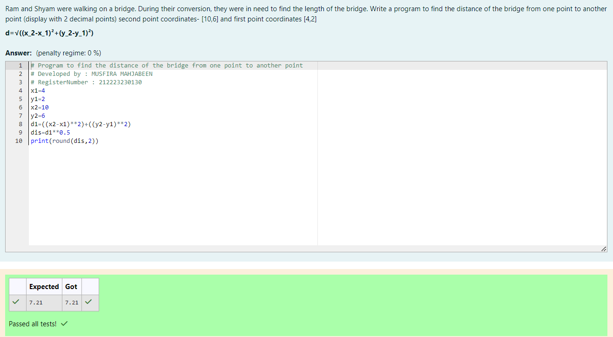

# DISTANCE-BETWEEN-TWO-POINTS

## AIM:

To write a python program to find the distance two 2 points

## ALGORITHM:

### Step 1:

Import the math module to use the built-in functions for calculation.

### Step 2:

Get the 2 points from the user.

### Step 3:

Substitute the values in the distance formula <br>


### Step 4:

Print the distance.

### Step 5:

End the program

### PROGRAM:

```python
# Program to find the distance of the bridge from one point to another point
# Developed by : MUSFIRA MAHJABEEN
# RegisterNumber : 212223230130
x1=4
y1=2
x2=10
y2=6
d1=((x2-x1)**2)+((y2-y1)**2)
dis=d1**0.5
print(round(dis,2))
```

### OUTPUT:



### RESULT:

Thus the program to find the distance between two points is written and verified using python programming.
